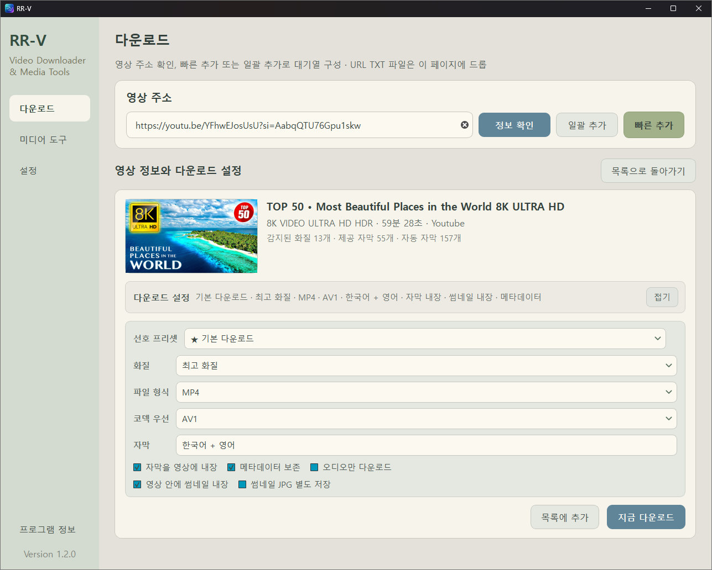
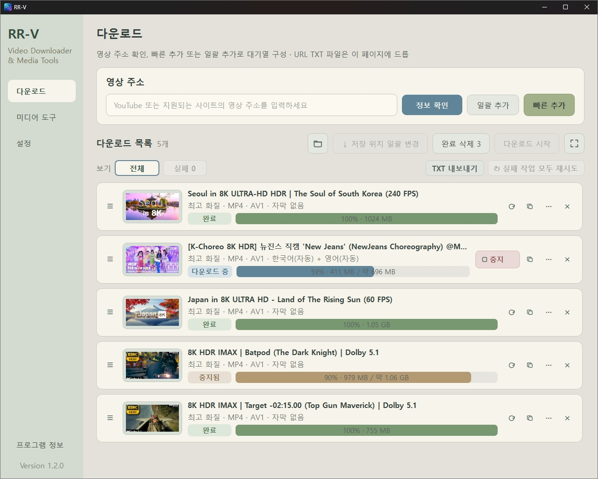
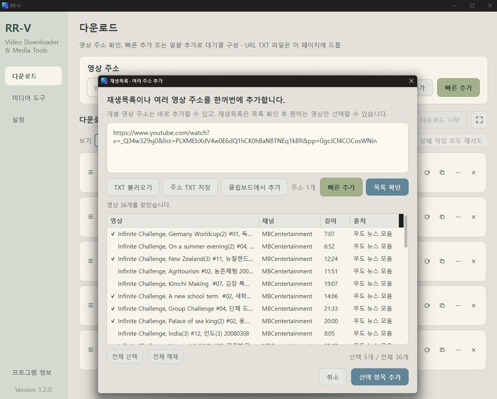
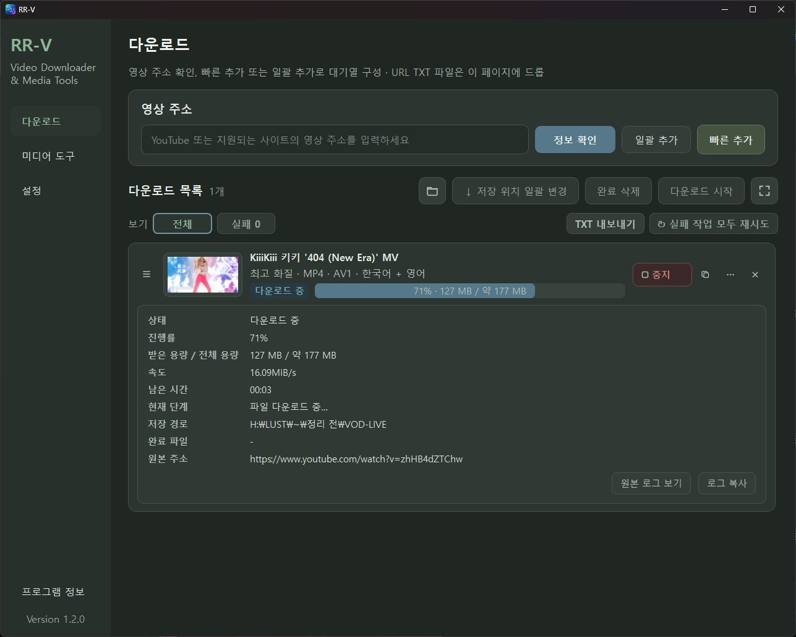
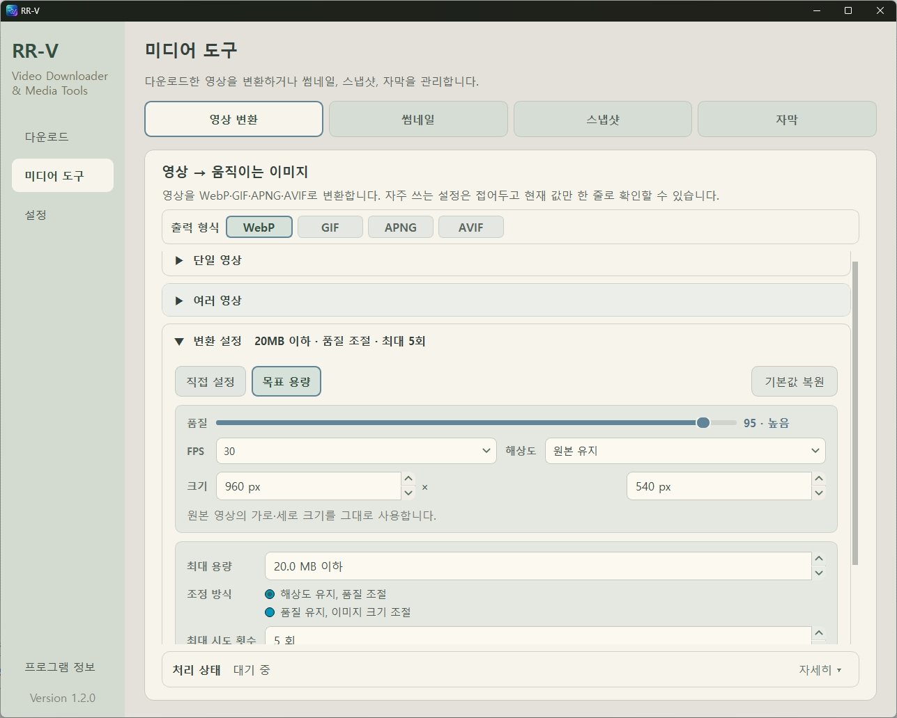
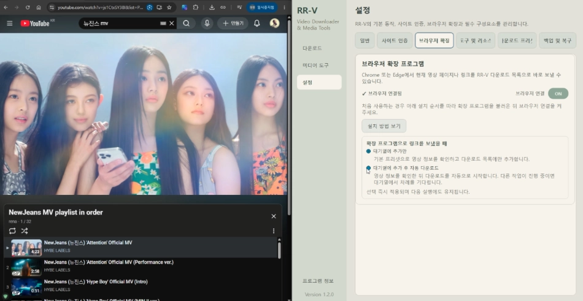
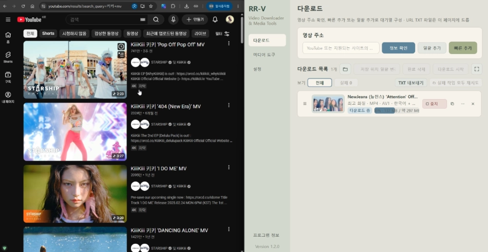

<p align="center">
  
</p>

# RR-V

### Video Downloader & Media Tools for Windows

**RR-V**는 널리 사용되는 오픈소스 영상 다운로드 도구 **yt-dlp**를 복잡한 명령어 없이 쉽고 빠르게 사용할 수 있도록 만든 Windows용 비디오 다운로드 & 미디어 도구입니다.

**현재 버전: 1.3.0 Community Beta**

➡️ **[최신 버전 다운로드 · GitHub Releases](https://github.com/Anima2099/RR-V/releases)**

설치 파일은 GitHub Releases에서 `RR-V_Setup_1.3.0.exe` 형태로 배포합니다.

---

## 특징

- **yt-dlp 기반의 다양한 사이트 영상 다운로드**
- **MP4 · MKV · WebM** 컨테이너와 **H.264 · VP9 · AV1** 코덱 선택 지원, **M4A · MP3 · Opus · FLAC** 오디오 다운로드 지원
- 썸네일 · 메타데이터 · 자막 저장 및 영상 파일 내장 지원
- 여러 URL 자동 감지, 일괄 추가 및 원하는 항목 선별 다운로드
- 실패 작업 일괄 재시도와 전체 · 완료 · 실패 목록 TXT 내보내기 / 불러오기
- 사용자 다운로드 프리셋 생성 · 수정 · 삭제 및 기본 프리셋 지정
- Chrome / Edge 브라우저 확장 프로그램을 이용한 빠른 URL 전송 및 다운로드
- **정식 / 베타 채널을 지원하는 RR-V 자체 업데이트 기능**
- yt-dlp / FFmpeg / FFprobe / Deno 상태 확인, 업데이트 및 복구 지원
- 영상을 **WebP · GIF · APNG · AVIF** 애니메이션 이미지로 단일 / 일괄 변환
- 단일 및 일괄 영상 썸네일 교체
- 영상 프레임 스냅샷 제작
- 자막 관리 및 관련 미디어 도구
- Light / Dark **Warm Sage** 테마

## 스크린샷

### 메인 인터페이스



### 다운로드 & 일괄 추가

| 다운로드 목록 | 여러 주소 · 재생목록 일괄 추가 |
| :---: | :---: |
|  |  |

### 다크 모드 & 미디어 도구

| 다크 모드 | 미디어 도구 |
| :---: | :---: |
|  |  |

## 설치 후 처음 할 일

RR-V를 처음 설치했다면 몇 가지 필수 구성요소를 준비해야 합니다.

1. RR-V를 실행합니다.
2. **설정 → 도구 및 리소스**로 이동합니다.
3. **필수 구성요소 설치**를 실행합니다.
4. 설치가 완료되면 영상 URL을 추가하여 사용할 수 있습니다.

RR-V는 필요한 `yt-dlp`, `FFmpeg / FFprobe`, `Deno`를 설치 파일 안에 포함하지 않습니다. 대신 필요한 경우 각 프로젝트의 공식 배포처에서 다운로드하여 사용자의 RR-V 데이터 폴더에 설치합니다.

## 프로그램 업데이트

RR-V 1.3.0부터 프로그램 자체 업데이트 기능을 지원합니다.

**정식 / 베타 업데이트 채널**을 선택할 수 있으며, 새 버전이 있으면 GitHub Releases의 Installer를 내려받아 파일 크기와 SHA-256 무결성 검증을 완료한 뒤 RR-V를 종료하고 설치 프로그램을 실행합니다.

> RR-V 1.2.0에는 자체 업데이트 기능이 없습니다. 기존 1.2.0 사용자는 `RR-V_Setup_1.3.0.exe`를 한 번 직접 설치해 주세요. 이후 버전부터는 RR-V 내부의 업데이트 기능을 사용할 수 있습니다.

## 사이트 로그인

일부 영상은 로그인 또는 인증이 필요할 수 있습니다.

RR-V는 현재 다음 사이트의 자체 로그인 기능을 제공합니다.

**YouTube · Instagram · TikTok**

지원되는 로그인 브라우저는 **Google Chrome · Microsoft Edge**입니다.

RR-V의 전용 로그인 창에서 해당 사이트에 로그인하면 인증 정보를 저장하여 이후 정보 확인과 다운로드에 사용합니다.

> RR-V는 Google, Instagram 또는 TikTok의 비밀번호를 직접 입력받거나 저장하지 않습니다.

## 브라우저 확장 프로그램

RR-V에는 Chrome / Edge용 **RR-V Browser Connector**가 포함되어 있습니다.

확장 프로그램을 설치하면 영상 페이지에서 RR-V 아이콘을 누르거나 영상 링크의 오른쪽 클릭 메뉴를 사용하여 현재 URL을 RR-V 다운로드 목록으로 바로 보낼 수 있습니다.

설치 방법은 **설정 → 브라우저 확장**에서 확인할 수 있습니다.

### Browser Connector 동작

| 확장 아이콘 클릭 | 영상 링크에서 오른쪽 클릭 |
| :---: | :---: |
|  |  |

## Community Beta

RR-V 1.3.0은 **Community Beta** 버전입니다.

기본 기능과 설치, 버전 업그레이드, 다운로드, 사이트 인증, Browser Connector, 미디어 도구 및 자체 업데이트 등의 주요 동작은 실제 환경에서 테스트를 거쳤지만 영상 사이트의 정책 변화, 사용자 PC 환경, 네트워크 상태 등에 따라 예상하지 못한 문제가 발생할 수 있습니다.

RR-V의 다운로드 기능은 yt-dlp를 기반으로 하므로 각 사이트의 변경이나 현재 yt-dlp 지원 상태에 따라 일부 사이트의 동작이 달라질 수 있습니다.

문제를 발견했다면 GitHub Issues 또는 아래 연락처를 통해 알려주세요.

**Developer:** Anima2099  
**Email:** [anima2099@proton.me](mailto:anima2099@proton.me)

## 라이선스

RR-V 본체는 **RR-V Source Available License 1.0**에 따라 배포됩니다.

개인적인 사용, 소스 코드 열람 및 개인 목적의 수정이 허용되며, 교육 · 연구 · 창작 · 업무에서 RR-V를 하나의 도구로 사용하는 것도 허용됩니다.

다만 RR-V 또는 수정된 RR-V를 재배포하거나, RR-V 자체를 판매 · 유료 배포하거나 그 자체를 상업적으로 이용하려면 저작권자의 사전 서면 허가가 필요합니다.

- [RR-V Source Available License 1.0 · English](LICENSE)
- [RR-V Source Available License 1.0 · 한국어 번역본](LICENSE.ko-KR.txt)
- [Third-party Notices](THIRD_PARTY_NOTICES.txt)
- [Source Availability / Written Offer](SOURCE_OFFER.txt)

한국어 번역본은 이해를 돕기 위한 편의 번역이며, 영어 원문과 해석이 다른 경우 영어 `LICENSE`가 우선합니다.

RR-V는 **Source Available** 소프트웨어이며, OSI가 정의하는 오픈소스 소프트웨어는 아닙니다. RR-V Auth Helper와 제3자 구성요소에는 각각 별도의 라이선스가 적용됩니다.

## 프로젝트 링크

**GitHub:** https://github.com/Anima2099/RR-V  
**Developer:** Anima2099  
**Contact:** [anima2099@proton.me](mailto:anima2099@proton.me)

### 후원하기

**Buy Me a Coffee:** https://buymeacoffee.com/anima2099

*RR-V를 잘 사용하고 계신다면 커피 한 잔 부탁드립니다!*

---

# Developer / Technical Information

아래 내용은 RR-V의 소스 구조, 빌드 방식 및 제3자 구성요소의 배포 구조에 관한 개발자용 정보입니다.

## 1.3.0 Distribution Model

RR-V 1.3.0 uses a PyInstaller **onedir** layout.

```text
dist/RR-V/
  RR-V.exe
  RR-V-Auth-Helper.exe
  LICENSE.txt
  LICENSE.ko-KR.txt
  THIRD_PARTY_NOTICES.txt
  SOURCE_OFFER.txt
  licenses/
  _internal/
```

The Community Beta Installer is built with Inno Setup 7 as a **per-user installation**. It does not request administrator elevation. The default installation directory is shown to the user and may be changed:

```text
%LOCALAPPDATA%\Programs\RR-V
```

RR-V is registered in Windows Installed Apps and includes a normal uninstaller. During uninstall, the user can choose whether RR-V user data under LocalAppData/AppData should also be removed. User-data deletion is off by default; RR-V integration registry entries are removed regardless.

The RR-V Installer does **not** bundle these large external executables:

- `yt-dlp.exe`
- `ffmpeg.exe`
- `ffprobe.exe`
- `deno.exe`

After RR-V is installed, the user can prepare missing required tools from **Settings > Tools & Resources**. RR-V downloads those tools from their official distribution channels and stores them under the user's LocalAppData RR-V tools directory.

The YouTube WPC/browser-authentication runtime is a separate locked runtime and is bundled as Python source plus package metadata because it is required by RR-V authentication and YouTube PO-token support.

## Authentication Boundary

RR-V core does not import `nodriver` directly.

```text
RR-V core
   |
   | JSON-lines process protocol
   v
RR-V Auth Helper
   |
   v
nodriver / Chromium browser
```

`RR-V-Auth-Helper.exe` is built as a separate process component. Its source is under `auth_helper/` and is also copied into the release `licenses/` directory. See `auth_helper/README.md`, `auth_helper/LICENSE_NOTICE.txt`, `THIRD_PARTY_NOTICES.txt`, and `SOURCE_OFFER.txt`.

## Repository Layout

```text
app/                   application settings, paths, stores, and shared app logic
auth_helper/           isolated browser-authentication helper source
controllers/           UI/controller coordination
core/                  core data models
installer/             Inno Setup script and Installer notes
services/              download, authentication, browser integration, media services
ui/                    main window, pages, dialogs, and widgets
workers/               background worker objects
resources/             icons, theme, browser connector, WPC runtime metadata
main.py                 application entry point
RR-V.spec               PyInstaller onedir build specification
RR-V-Auth-Helper.spec   separate Auth Helper build specification
BUILD_RELEASE.ps1       integrated release build and license/source packaging
BUILD_INSTALLER.ps1     verifies dist/RR-V and builds RR-V_Setup_1.3.0.exe
PREP_WPC_PROVIDER.ps1   prepares the locked WPC/nodriver runtime
PACKAGING_CHECKLIST.txt release/regression checklist
LICENSE                 authoritative RR-V Source Available License 1.0 text
LICENSE.ko-KR.txt       Korean convenience translation; English LICENSE controls
THIRD_PARTY_NOTICES.txt third-party component and license map
SOURCE_OFFER.txt        source-availability information for copyleft components
```

## Development Notes

Install the Python dependencies from `requirements.txt` in the RR-V virtual environment.

The repository intentionally does **not** track generated or machine-local items such as:

- `.venv/`
- PyInstaller `build/`, `dist/`, and helper build output
- generated `installer-output/`
- `resources/wpc-provider/runtime/`
- external runtime executables under `resources/tools/`
- logs, queue data, settings, cookies, and login credentials
- local release ZIP / Installer files

Prepare the exact WPC/nodriver runtime with:

```powershell
powershell -ExecutionPolicy Bypass -File .\PREP_WPC_PROVIDER.ps1
```

Create the complete 1.3.0 onedir release with:

```powershell
powershell -ExecutionPolicy Bypass -File .\BUILD_RELEASE.ps1
```

`BUILD_RELEASE.ps1` builds the Auth Helper and RR-V, places the helper beside `RR-V.exe`, verifies that yt-dlp / FFmpeg / FFprobe / Deno were not accidentally bundled, and collects release license/source materials.

After installing Inno Setup 7, create the Community Beta Installer with:

```powershell
powershell -ExecutionPolicy Bypass -File .\BUILD_INSTALLER.ps1
```

Expected output:

```text
installer-output\RR-V_Setup_1.3.0.exe
```

`BUILD_INSTALLER.ps1` verifies the release layout and license files again, rejects accidentally bundled external tools or Qt Virtual Keyboard, finds `ISCC.exe`, compiles the Installer, and prints its SHA-256 hash. See `installer/README.md` for the install/uninstall policy and smoke-test flow.

Before a release, follow `PACKAGING_CHECKLIST.txt`.

## Authentication Data

RR-V stores user settings and authentication data outside the source tree under the user's Windows AppData directories. Cookie files contain private login credentials and must never be committed or shared.

The `.gitignore` contains additional defensive rules in case such files are accidentally copied into the project folder.

## Browser Connector

The Chromium extension source is under:

`resources/browser-extension/rrv-chromium/`

It is used by RR-V to send the current page or selected links to the running application, with Native Messaging as a fallback path when RR-V is fully stopped.

## Third-party Software and Licenses

See:

- `THIRD_PARTY_NOTICES.txt`
- `SOURCE_OFFER.txt`
- `auth_helper/LICENSE_NOTICE.txt`

The release build also generates a `licenses/` directory containing the exact available license/metadata files from the Python, PySide6/Qt, shiboken6, and locked WPC packages used by that build.

The RR-V-specific source under `auth_helper/` is separately licensed under **AGPL-3.0-only**. Third-party components retain their respective upstream licenses.

External yt-dlp / FFmpeg / Deno executables downloaded after installation remain governed by their respective upstream licenses.

## Project Status

`main` contains the current **RR-V 1.3.0 Community Beta** source. The `1.3.0-community-beta` branch is retained as the current Community Beta development/release line. Previous release lines such as `1.2.0-community-beta` and the 1.1.3 tested baseline are preserved separately.
